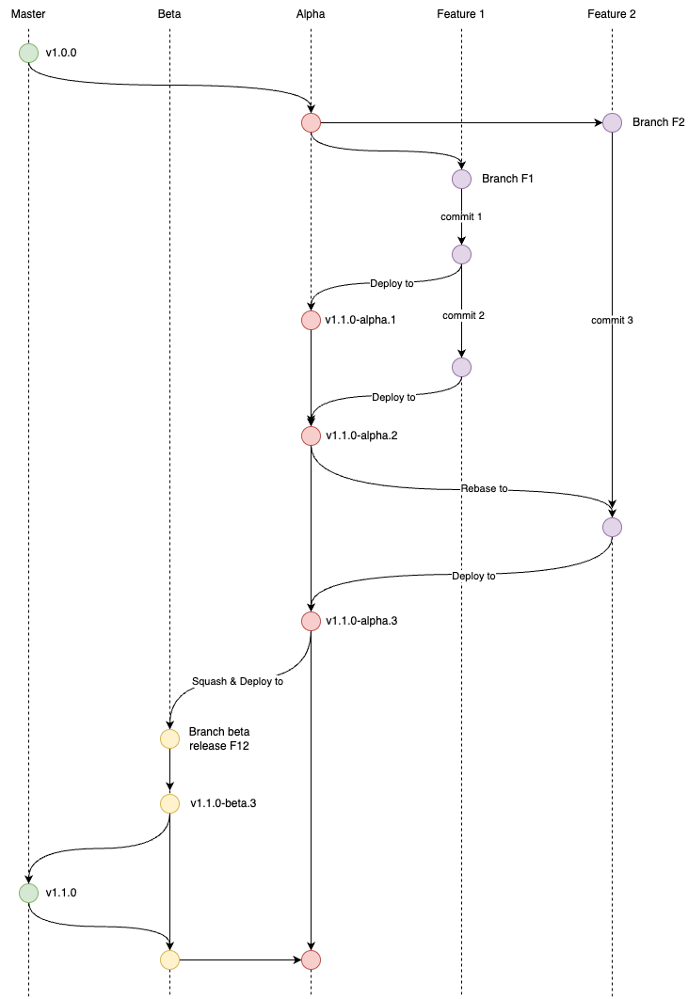
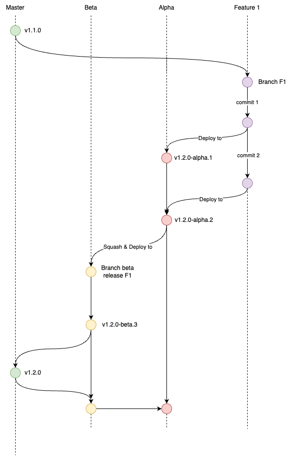

# Hasurify GraphQL Library

[](https://badge.fury.io/js/angular2-expandable-list)
[](https://github.com/prettier/prettier)
[](https://google.github.io/styleguide/tsguide.html)

## Getting Started

Use NPM CLI

```sh
$ npm i @hasurify/graphql@1.0.0
```

Use yarn CLI

```sh
$ yarn add @hasurify/graphql@1.0.0
```

## Development

### Hasura

#### Install Hasura CLI

```sh
make hasura/install
```

#### Apply Hasura migrations and metadata

```sh
make hasura/apply-all
```

#### Apply only Hasura metadata

```sh
make hasura/apply-metadata
```

### Commit rules

We'll be setting up our repo to use AngularJS's commit message convention, also known as conventional-changelog. To go with it, we'll be using [commitizen](https://github.com/commitizen/cz-cli) and [cz-conventional-changelog](https://github.com/commitizen/cz-conventional-changelog).

So, instead of using `git commit -m "Message"`, please use `yarn commit`.

### Usage

```js
import { mutate, query } from '@hasurify/graphql';
import { updateUser } from '@hasurify/graphql/graphql/requests/user';
```

## Release workflow

We are using [semantic release](https://github.com/semantic-release/semantic-release) strategy for this NPM package. It's required to follow [Angular Commit Message Conventions](https://github.com/angular/angular/blob/master/CONTRIBUTING.md#-commit-message-format). The commit message format can be changed with the [preset or config options](https://github.com/semantic-release/semantic-release/blob/master/docs/usage/configuration.md#options) of the [@semantic-release/commit-analyzer](https://github.com/semantic-release/commit-analyzer#options) and [@semantic-release/release-notes-generator](https://github.com/semantic-release/release-notes-generator#options) plugins.

### Version release



Let's assume the latest stable tag of the protected branches (master, beta, and alpha) is `v1.0.0`. You will now start working on a new feature. Please follow the steps below:

1. Create a new feature branch `(feat or fix or chore)/short_desc` from `alpha` branch to work on.
2. Make a new commit to the feature branch using `git add . && yarn commit`. For more information on commit message conventions, please refer to the [commitizen](https://github.com/commitizen/cz-cli) and [cz-conventional-changelog](https://github.com/commitizen/cz-conventional-changelog) guidelines. You can enter the JIRA ticket ID or feature name for the `component`.
3. Cherry-pick and push that commit or create a PR to the `alpha` branch in order to publish a new alpha version called `v1.1.0-alpha.1`. This action will also create a new tag with the same name and a [new pre-release](https://github.com/hasurify/graphql/releases). The pre-release note will include all your commit messages, publishing time, and contributors.
4. Continue working if necessary.
5. Rebase the `alpha` branch to incorporate the new tag into your branch. If you skip this step, the CI will be unable to publish a new version for your next commit.
6. Make another commit to the feature branch using `git add . && yarn commit`.
7. Repeat step 3 for this new commit. The CI will run to publish a new version called `v1.1.0-alpha.2`.
8. Install the new version of the package on Backend or Frontend to carefully verify it in your local and development environment.
9. Create a new branch from the `beta` branch and then cherry-pick all the commits into it.
10. Create a new PR to the `beta` branch.
11. Once other developers have reviewed, approved, and merged that PR, the CI will run to publish a new beta version called `v1.1.0-beta.1`.
12. Install the beta version of the package on your Backend or Frontend branch, which is created from the `beta` branch, for thorough verification.

At the end of the development version (sprint), we will deploy all the changes from the `beta` branch to the `master` branch. The CI will release the stable version.

### Hotfix release



The hotfix release workflow is similar to the version release. The only difference is that you will be required to create a new branch from the `master` branch instead of `alpha`. Then, you need to deploy to `alpha` in order to verify the hotfix version on the Backend or Frontend development environment. After that, you will follow the same steps as the version release.

> Note: You're not allowed to publish the new NPM version directly from your local machine.

### Testing

Please write your testcases only in the `__tests__` directory, and make sure its name follows the format `*.test.ts`, `*.spec.ts`, or `*.e2e.ts`.

Please use the following command to run your tests in your local machine:

```sh
$ yarn test
```

If you want to see the coverage summary, please use the following command:

```sh
$ yarn coverage:ci
# or
$ yarn coverate:ci:summary
```

### GraphQL tools

There are two GraphQL tools that provide a better overview of our database and GraphQL definitions, as well as relationships.

- **Hasura GraphQL faker** is a tool that enables us to mock future APIs or enhance existing APIs by generating realistic data using faker.js. No coding is required.

- **Hasura GraphQL graph** provides an overview of our GraphQL type definitions and relationships.

Start the Hasura GraphQL tools:

```sh
$ docker-compose up --build # or dcupd --build
```

Access those tools on your browser via the following URLs:

- [Hasura GraphQL faker](http://localhost:5002/editor)
- [Hasura GraphQL graph](http://localhost:5003/voyager)
